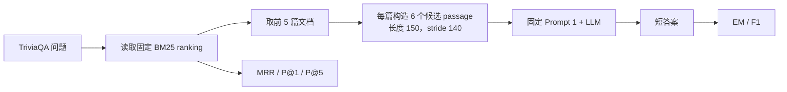
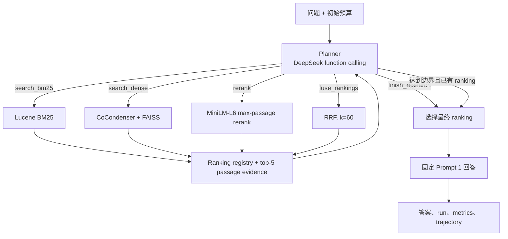

# QryEval_PLUS：从固定流程 RAG 到 Agentic RAG 的项目升级与对照实验报告

> 实验日期：2026-08-14<br>
> 正式实验规模：TriviaQA 40 题<br>
> 项目版本：QryEval_PLUS 0.3.0<br>
> 报告口径：历史结果用于纵向参考；Agent 效果只与本轮同环境固定基线比较

## 摘要

原课程项目的核心目的，是在一条预先配置好的信息检索与 RAG 流程上，控制变量比较稀疏检索、稠密检索、段落构造、神经重排和提示词。每个问题都执行相同的固定步骤，运行过程中不会根据当前证据决定是否重写问题、再次检索、重排或融合结果。因此，虽然旧代码中存在名为 `Agent` 的回答模块和 `agentDepth` 参数，它在本报告的定义下仍属于固定流程 RAG，而不是能够自主选择动作的 AI Agent。

升级后的项目完整保留原 `type: rag` 路径，同时新增 Python 3.11、LangGraph `StateGraph`、DeepSeek 原生 function calling 和 Pydantic 严格校验构成的单 Agent 检索循环。Agent 能针对每道题选择 BM25、CoCondenser + FAISS 稠密检索、MiniLM-L6 重排、RRF 融合以及最终证据；所有动作均受检索次数、工具次数和图步数限制。最终答案仍由同一个 Prompt 1 生成，以尽量把实验变量限定在“谁控制检索过程”。

40 题正式实验中，本轮固定 BM25 RAG 的 EM/F1 为 67.50/80.50；BM25-only Agent 达到 72.50/85.24，分别提高 5.00 和 4.74 个百分点，同时 MRR 从 0.6643 提升到 0.7951；全工具 Agent 达到 72.50/83.89，F1 提高 3.39 个百分点。两个 Agent 的逐题 F1 配对 bootstrap 95% 置信区间都跨过 0，因此结论是“点估计显示提升，但 40 题样本尚不足以证明稳定的统计提升”。在两个 Agent 中，BM25-only Agent 的质量更高、耗时和 token 更低，是本轮实验的最佳方案。

## 1. 项目背景与研究问题

项目面对的是一个典型的开放域问答任务：输入自然语言问题，从 ClueWeb22 文档集合中检索证据，再由大语言模型依据证据给出 TriviaQA 短答案。项目需要同时评估两个层面：

1. 检索层是否把相关文档排到前面；
2. 回答层是否生成与标准答案一致或高度重合的答案。

原课程项目回答的是：在固定流程中，哪一种检索器、段落长度、候选段落策略、重排模型或提示词更好？

升级项目新增的研究问题是：在检索器、索引、问题、标准答案、回答提示和评价方法保持一致时，让 LLM 根据每道题的证据动态选择检索动作，是否比所有问题执行同一路径取得更好的答案质量？

这一区别可概括为：

- 原项目优化的是一条由实验者预先设计的流水线；
- 升级项目研究的是一个受预算约束、能够按题决策的检索策略。

## 2. 原课程项目做了什么

### 2.1 原项目的 purpose

原项目是一个可配置的信息检索与 RAG 实验框架。其主要价值不是让系统自由行动，而是提供受控、可复现的实验环境：研究者通过 JSON/参数文件决定任务顺序，然后让整批问题执行完全相同的流程，以比较单一实验变量。

迁移后的仓库保留了 HW5 的 35 组可执行配置：

| 实验类别 | 数量 | 主要研究变量 |
| --- | ---: | --- |
| Passage 实验 | 16 | BM25/稠密检索、首段/最佳段、50/100/150/200 长度 |
| Prompt 实验 | 12 | BM25/稠密检索下的 6 种回答提示 |
| System 实验 | 7 | BM25、稠密检索、MiniLM-L6/L12 重排、上下文深度、grounded prompt |
| 合计 | 35 | 固定 RAG 各组成部分的控制变量比较 |

### 2.2 固定流程

一个典型的原 HW5 最佳流程如下：



框架本身也支持更宽的固定链路：

`queries → BM25/Boolean/FAISS ranker → 可选 PRF → 可选 LTR/BERT reranker → TREC run → 固定 RAG → answers`

关键特征是，任务开始前就确定全部步骤。某一道题即使证据不足，也不会自行换检索器或追加一次检索。

### 2.3 原项目技术栈

| 层次 | 技术 | 用途 |
| --- | --- | --- |
| 运行环境 | Python 3.9、Conda、OpenJDK | 课程代码与 JVM 检索环境 |
| 稀疏检索 | Lucene、Pyjnius、BM25 | 基于词项匹配生成 ranking |
| 稠密检索 | PyTorch、Transformers、CoCondenser、FAISS | 语义向量编码与近邻检索 |
| 神经重排 | MS MARCO MiniLM-L6/L12 cross-encoder | 对前若干候选进行相关性重排 |
| 传统重排 | PRF、RankLib/SVMRank 支持 | 查询扩展和 Learning-to-Rank 实验 |
| RAG | PassageBuilder、固定 Prompt 模板、LLM | 从指定 ranking 构造上下文并回答 |
| 评价 | TriviaQA gold aliases、qrels、`trec_eval` | 计算 EM、F1、MRR、P@1、P@5 |
| 实验编排 | 按编号排序的任务配置 | 保证批量实验按固定顺序执行 |

需要区分两个时间层次：原课程源代码使用课程环境中的自定义 LLM 传输；迁移到 QryEval_PLUS 后，固定流程的检索与实验语义保持不变，但回答接口改成了 HTTPS Chat Completions provider，并通过环境变量读取 DeepSeek 凭据。这个接口迁移提升了安全性和可执行性，但不等同于 Agent 升级。

### 2.4 原 HW5 历史结果

下表来自只读历史 CSV。Custom1–Custom6 依据 Exp3.1b–Exp3.1g 的配置顺序映射为对应系统：

| 历史系统 | EM | F1 | MRR | P@1 | P@5 | 时间 |
| --- | ---: | ---: | ---: | ---: | ---: | ---: |
| BM25 固定基线 | **40.00** | **54.17** | 0.6643 | 0.6000 | **0.4150** | 08:35 |
| Dense 固定基线 | 22.50 | 32.18 | 0.4544 | 0.3500 | 0.2100 | 06:56 |
| BM25 + MiniLM-L6 | 32.50 | 51.35 | **0.6814** | **0.6250** | 0.3900 | 20:53 |
| Dense + MiniLM-L6 | 27.50 | 42.35 | 0.6057 | 0.5250 | 0.2950 | 10:41 |
| Dense + MiniLM-L12 | 27.50 | 42.08 | 0.6064 | 0.5750 | 0.2600 | 13:12 |
| Dense + context depth 8 | 27.50 | 36.61 | 0.4544 | 0.3500 | 0.2100 | 09:21 |
| Dense + grounded prompt | 7.50 | 14.02 | 0.4544 | 0.3500 | 0.2100 | 06:24 |

按照本项目“F1 优先、EM 次之”的选择规则，历史最佳系统是 BM25 固定基线，即 `BM25 → best passage 150 → top 5 documents → Prompt 1`。历史数据也说明，增加稠密检索或神经重排并不必然改善最终答案：检索指标与生成指标相关，但不是同一个目标。

### 2.5 原项目的能力边界

原项目适合做控制变量实验，但有以下研究边界：

- 所有问题经过同一条路径，无法按问题难度分配计算量；
- 证据不足时不能自主改写查询或二次检索；
- 无法在 BM25 与 dense 之间按题选择；
- 重排与融合必须预先写入配置，不能由当前证据触发；
- 旧 `Agent` 类负责从固定 ranking 生成答案，并不执行“观察—决策—工具—再观察”的循环；
- `agentDepth` 只是送入回答模块的文档数量，不代表 Agent 推理深度。

这些不是原项目的实现缺陷，而是其“严格控制流程变量”这一实验目的带来的设计选择。

## 3. 升级项目做了什么

### 3.1 升级后的 purpose

升级没有替换原项目，而是在同一个框架中增加第二种运行范式：

- `type: rag`：保留原有固定流程，用作稳定基线和既有 35 个实验的兼容入口；
- `type: agentic_rag`：由单 Agent 针对当前问题和证据选择下一步动作。

因此，项目从“固定检索/RAG 配置比较器”升级为“固定 RAG 与 Agentic RAG 可在同一协议下对照的研究平台”。升级的目标不是证明工具越多越好，而是测量动态检索控制本身是否有价值，以及这种价值需要多少延迟和 token 成本。

### 3.2 Agentic RAG 架构



LangGraph 图的主循环是 `planner → tool execution → evidence → planner/finalize`。Planner 的直接文本不会成为实验答案；无论采用哪条检索路径，最后都由冻结的 Prompt 1 基于所选 ranking 生成答案，从而避免把检索策略变化与回答提示变化混在一起。

### 3.3 工具集合

| 工具 | 实现与参数 | 作用 |
| --- | --- | --- |
| `search_bm25(query)` | 原问题复用版本化 BM25 run；改写问题实时使用 Lucene BM25，k1=1.2、b=0.75 | 精确词项检索与查询改写 |
| `search_dense(query)` | CoCondenser 编码 + FAISS 索引 | 补充语义相似结果 |
| `rerank(ranking_id, query)` | MiniLM-L6、depth 100、max-passage | 精细判断候选相关性 |
| `fuse_rankings(ranking_ids)` | Reciprocal Rank Fusion，k=60 | 融合多条 ranking |
| `finish_research(ranking_id)` | 选择 ranking，不直接生成答案 | 结束研究并进入统一回答步骤 |

BM25-only Agent 只开放 `search_bm25` 与 `finish_research`，用于隔离“规划 + 查询改写”的作用；全工具 Agent 开放上述五种工具。

### 3.4 有界决策与状态管理

为避免无限循环和不可控成本，正式配置固定为：

| 约束 | 值 |
| --- | ---: |
| 最大 Planner turn | 6 |
| 最大检索调用 | 3 |
| 最大 rerank 调用 | 1 |
| 最大 fusion 调用 | 1 |
| 每次返回给 Planner 的 passage | top 5 |
| passage 长度 / stride / 候选数 | 150 / 140 / 6 |
| 最终上下文文档数 | 5 |

`AgentState` 保存问题、消息、ranking registry、工具轨迹、预算、最终 ranking、答案、token、延迟、错误和停止原因。达到上限时，如果已经存在有效 ranking，则使用最后一个有效结果回答并记录停止原因；如果没有有效 ranking，则输出空答案，不能暗中回退到固定 BM25 流程。

### 3.5 升级后的技术栈

| 层次 | 新增或升级技术 | 价值 |
| --- | --- | --- |
| Agent 编排 | LangGraph 1.x `StateGraph` | 显式建模循环、条件边和终止状态 |
| 模型决策 | DeepSeek `deepseek-v4-flash` 原生 function calling | 输出结构化工具选择，而不是解析自由文本 |
| 数据校验 | Pydantic 2.x，禁止未知字段 | 校验工具名称、参数和 Agent 状态 |
| 独立环境 | Python 3.11、OpenJDK 25、FAISS CPU 1.8 | 满足 LangGraph/Pydantic，同时不修改 Python 3.9 历史环境 |
| 模型运行 | PyTorch 2.0.1、Transformers 4.40.2 | 复用 CoCondenser 与 MiniLM 本地模型 |
| Provider | OpenAI-compatible Chat Completions 扩展 | 支持 `tools`、`tool_choice`、`tool_calls`、`finish_reason`，并兼容旧 `generate(messages)` |
| 恢复能力 | 每题 checkpoint、`--resume` | API 中断后只重跑失败或未完成题目 |
| 可观测性 | `trajectory.jsonl`、`llm.json`、runtime/metrics | 记录决策、工具、token、延迟、错误和停止原因 |
| 可复现性 | manifest、环境/模型/输入哈希、结果 checksum | 固定实验输入并审计来源 |
| 命令行 | `qryeval run`、`qryeval benchmark`、`qryeval doctor` | 统一执行、对照实验与环境检查 |

### 3.6 工程层升级

除 Agent 算法外，项目还完成了以下工程化改造：

- 使用 `src/qryeval_plus` 包结构和可安装的 `qryeval` CLI；
- 相对路径按所属配置文件解析，不再依赖执行时 shell 所在目录；
- 确定性排序任务、自动发现 Conda JVM、保证索引清理；
- Java 依赖随包提供，敏感凭据只从环境变量读取；
- 保存问题、配置、模型和历史结果来源的 SHA-256；
- 每道题完成后写入结果，支持长实验断点恢复；
- 增加 unit、graph mock、真实 Lucene/FAISS/CoCondenser/MiniLM integration 和 Python 3.9 兼容测试。

这些变化使项目不仅能“跑出一次结果”，还能够解释结果来自哪个配置、模型和输入，并能在异常后恢复。

## 4. 对照实验设计

### 4.1 四个比较系统

| 系统 | 作用 | 能否用于 Agent 因果归因 |
| --- | --- | --- |
| 原 HW5 历史最佳基线 | 展示课程项目历史成绩 | 否，只作描述性参考 |
| 本轮固定 BM25 RAG | 控制当前模型、日期、网络和后处理 | 是，主要对照组 |
| BM25-only Agent | 测试规划与 BM25 查询改写 | 是 |
| BM25 + Dense + MiniLM + RRF Agent | 测试完整工具选择能力 | 是 |

本轮三个可执行系统统一使用 DeepSeek `deepseek-v4-flash`、thinking 关闭、temperature 0 和 Prompt 1。历史结果来自早期课程运行环境，因此历史列与当前列之间的差异不能单独归因于 Agent。

### 4.2 保持一致的实验条件

- 同一批按固定顺序排列的 40 个 TriviaQA 问题；
- 同一份 TriviaQA gold aliases 和 qrels；
- 同一 ClueWeb22 Lucene/FAISS 文档集合；
- 同一版本化 BM25 baseline run；
- 同一 CoCondenser 和 MiniLM-L6 本地模型；
- 同一 passage 参数与最终 top-5 上下文；
- 同一 Prompt 1、答案规范化和评价代码；
- qrels 先过滤到 40 个 qid，再用 `trec_eval -c`，缺失 query 按 0 计分；
- 固定基线的 MRR/P@1/P@5 必须精确复现历史检索指标。

前 5 题只作为工程 smoke test，只允许修复协议、恢复、工具调用和运行错误，不允许根据正确答案调 prompt 或检索参数。配置冻结后运行全部 40 题，并另外报告剩余 35 题 holdout。

### 4.3 指标定义

| 指标 | 评价对象 | 含义 |
| --- | --- | --- |
| EM / `exact` | 最终答案 | 规范化预测是否与任一 gold alias 完全一致 |
| F1 | 最终答案 | 预测与 gold alias 的 token overlap F1，取最佳 alias |
| MRR | 最终 ranking | 第一个相关文档倒数排名的均值 |
| P@1 | 最终 ranking | 前 1 个结果中的相关文档比例 |
| P@5 | 最终 ranking | 前 5 个结果中的相关文档比例 |
| time | 整个系统 | 40 题总墙钟时间 |

额外记录 Agent 的模型调用、工具调用、检索轮数、token、LLM 延迟、预算触顶、schema/tool error、最大步数、空答案和工具频率。

统计检验使用逐题 F1 的 paired bootstrap：10,000 次采样，随机种子 `20260814`，报告 Agent 减固定基线的均值差和 95% 置信区间。

## 5. 正式实验结果

### 5.1 总体结果

| 系统 | EM | F1 | MRR | P@1 | P@5 | 40 题时间 |
| --- | ---: | ---: | ---: | ---: | ---: | ---: |
| 原 HW5 历史最佳基线 | 40.00 | 54.17 | 0.6643 | 0.6000 | 0.4150 | 08:35 |
| 本轮固定 BM25 RAG | 67.50 | 80.50 | 0.6643 | 0.6000 | 0.4150 | 02:21 |
| LangGraph BM25-only Agent | **72.50** | **85.24** | **0.7951** | **0.7500** | **0.5100** | 08:26 |
| LangGraph 全工具 Agent | **72.50** | 83.89 | 0.7080 | 0.6500 | 0.4400 | 15:09 |

固定 BM25 的三项检索指标与历史值完全一致，证明问题、qrels 和版本化 BM25 run 的检索评价已成功复现。历史到当前固定流程的 EM/F1 增幅很大，但它可能来自 LLM 服务、运行日期、回答接口或后处理变化，只能描述，不能作为 Agent 收益。

### 5.2 相对本轮固定基线的提升

| 系统 | ΔEM | ΔF1 | ΔMRR | ΔP@1 | ΔP@5 | F1 95% CI |
| --- | ---: | ---: | ---: | ---: | ---: | --- |
| BM25-only Agent | +5.00 | **+4.74** | **+0.1308** | **+0.1500** | **+0.0950** | [-3.58, 13.75] |
| 全工具 Agent | +5.00 | +3.39 | +0.0437 | +0.0500 | +0.0250 | [-5.36, 12.50] |

两个 Agent 在所有主要指标上的点估计都高于固定基线，说明动态检索值得继续研究。但两个置信区间都包含 0；在当前 40 题样本上，无法排除提升来自题目抽样波动。因此不能写成“已经证明 Agent 显著提升”，准确表述应是“观察到提升，但统计证据不足”。

### 5.3 35 题 holdout

| 系统 | EM | F1 | MRR | P@1 | P@5 |
| --- | ---: | ---: | ---: | ---: | ---: |
| 本轮固定 BM25 RAG | 68.57 | 81.53 | 0.6711 | 0.6000 | 0.4171 |
| BM25-only Agent | **71.43** | **84.08** | **0.7944** | **0.7429** | **0.5143** |
| 全工具 Agent | **71.43** | 82.54 | 0.7186 | 0.6571 | 0.4571 |

去掉用于工程调试的前 5 题后，两种 Agent 的点估计仍高于固定基线，说明总结果并非完全由 smoke set 造成。不过 holdout 中 BM25 Agent 的 F1 增幅约为 2.55 个百分点，低于 40 题总体的 4.74，进一步说明目前样本量较小、结果易受少数题影响。

### 5.4 Agent 行为与成本

| 系统 | 平均模型调用 | 平均工具调用 | 平均检索 | 平均 rerank | 平均 fusion | 平均 token | LLM 延迟/题 | 总时间 |
| --- | ---: | ---: | ---: | ---: | ---: | ---: | ---: | ---: |
| BM25-only Agent | 3.95 | 2.83 | 1.85 | 0.000 | 0.000 | 8,194.2 | 6.07 s | 08:26 |
| 全工具 Agent | 4.40 | 4.47 | 2.48 | 0.475 | 0.400 | 15,019.5 | 8.47 s | 15:09 |

BM25-only Agent 的工具总调用为 `search_bm25=78`、`finish_research=35`；全工具 Agent 为 `search_bm25=60`、`search_dense=52`、`rerank=19`、`fuse_rankings=16`、`finish_research=32`。

全工具 Agent 相比 BM25-only Agent：

- 总时间约为 1.80 倍；
- 平均 token 约为 1.83 倍；
- F1 反而低约 1.35 个百分点；
- MRR、P@1、P@5 也全部更低。

预算限制被触发的题目比例分别为 10.0% 和 32.5%。这表示 Planner 曾尝试执行超出冻结预算的动作，系统随后使用已有有效 ranking 正常完成，并不属于工具错误。两个系统的 schema/tool error、最大步数停止和空答案率均为 0%。

## 6. 逐题案例与原因分析

### 6.1 典型提升

| qid | 问题摘要 | 固定答案 | Agent 答案 | ΔF1 | 解释 |
| --- | --- | --- | --- | ---: | --- |
| `dpql_2585` | “death to spies” 对应哪个机构 | Counter Intelligence Corps | SMERSH | +100 | 改写/追加检索找到直接包含名称含义的证据 |
| `sfq_21572` | 2000 年首次获得 Test status 的板球队 | Ireland | Bangladesh | +100 | 动态检索纠正了固定上下文中的错误实体 |
| `dpql_5685` | 1846 年巴黎化学家命名的开胃酒 | “The aperitif is Dubonnet.” | Dubonnet | +50 | 证据更直接，同时短答案格式改善 EM/F1 |
| `tc_2090` | 谁最早画 Mickey Mouse | 只回答 Walt Disney 配音 | Ub Iwerks… | +30.77 | BM25 Agent 补回问题真正询问的实体 |

这些例子表明 Agent 的主要收益来自两类行为：为难题重写查询，以及在初始 ranking 不充分时继续检索。对于固定流程已经能回答的简单题，多一次工具调用通常不会改变 F1。

### 6.2 典型退化

`odql_921` 询问哪份英国日报采用 Berliner 版式。固定流程正确回答 `The Guardian`；BM25 Agent 虽把 qrels 相关文档排到第 1 位，却回答成关于 `The Observer` 的否定说明，F1 下降 91.30；全工具 Agent 回答 `The Independent`，F1 下降 100。

这个案例说明“检索指标提升”不保证“最终答案提升”。原因可能包括：top-5 passage 中存在相互冲突的报纸名称、最佳 passage 选择偏离问题限定词 `daily`，以及生成模型没有从相关文档中抽取正确实体。后续改进应同时约束检索决策和最终证据一致性。

全工具 Agent 在 `sfq_6038` 上将 Nigel Farage 的党派回答收窄为 Brexit Party/Reform UK，虽然检索指标没有下降，但相对包含 UKIP alias 的固定答案，token F1 下降约 14.48。这提示 TriviaQA 的多别名和时间敏感实体会让“语义上合理”与“离线 gold 匹配”产生偏差。

### 6.3 为什么全工具 Agent 没有胜过 BM25-only Agent

本轮数据支持以下解释，但它们属于基于轨迹和指标的推断，不是已经单独验证的因果结论：

1. TriviaQA 的许多问题依赖明确实体和词项，BM25 查询改写已经能获得主要收益；
2. dense 检索可能带入语义相关但不直接回答问题的段落；
3. RRF 将质量不同的 ranking 等权融合，可能稀释 BM25 的强精确匹配；
4. 更多 ranking 和工具输出增加 Planner 上下文与决策复杂度；
5. 全工具 Agent 更频繁触及预算边界，表明现有 Planner 尚未形成高效的工具选择策略；
6. 40 题规模使少数收益或退化题对均值影响很大。

因此，“增加工具”不是升级成功的充分条件；更重要的是让 Agent 学会判断何时需要特定工具，以及何时应该停止。

## 7. 实验异常、恢复与验收

实验遵循“发现异常即暂停、修复协议问题后从 checkpoint 重试”的原则，正式过程中处理了四类问题：

1. 5 题 smoke test 暴露 `inRankFile` 的子集 qid 错误；修复为只填充当前批次 qid，缺失活动 qid 使用空 ranking；
2. 初次在线 smoke test 遇到本地网络沙箱，在获得允许的网络环境后重跑；失败尝试未保留为实验答案；
3. 合法并行工具调用触及预算时曾被误分类为 tool error；修复为正常预算状态，并允许基于已有 ranking 执行 rerank、fusion 或 finish；
4. 正式 BM25 Agent 的 `qz_1032` 收到一次 malformed tool call；暂停全工具实验，增加单次 Planner 响应重试和 retry-aware resume，复用已完成的 39 题，只重跑该题并成功完成。

所有修复都针对执行、错误分类和恢复机制，没有根据正确答案调整 prompt、gold、检索参数、工具预算、指标或选择规则。

最终验收结果：

- 三个本轮系统均有 40 个答案、40 条 metadata 和覆盖 40 个 qid 的 TREC run；
- 空答案、provider failure、Agent error、schema/tool error、max-step 均为 0；
- 固定 BM25 精确复现历史 MRR 0.6643、P@1 0.6000、P@5 0.4150；
- 结果文件未检出 API key 模式；
- 32 个正式结果文件已通过 SHA-256 校验；
- Python 3.11 unit suite：36 passed、3 skipped；真实本地集成：3 passed；Python 3.9 兼容 suite：26 passed、4 skipped；
- 原有 35 个 RAG 配置和新增 Agent/benchmark 配置均保留，Python 3.9 环境未被修改。

## 8. 结论

### 8.1 对原项目的判断

原项目是一套完整的固定流程 IR/RAG 实验框架，其优势是变量清楚、批量实验稳定、检索与回答指标完整。它不是“低级版 Agent”，而是面向控制变量研究的另一种系统设计。它为本次升级提供了可靠的检索器、索引、重排模型、数据和基线。

### 8.2 对升级效果的判断

升级在工程目标上已经完成：项目同时支持固定 RAG 和有界 Agentic RAG，具备结构化工具调用、严格校验、预算控制、轨迹、断点恢复和可复现实验入口，并保持旧配置兼容。

升级在实验点估计上取得提升：BM25-only Agent 相对本轮固定基线提高 EM 5.00、F1 4.74、MRR 0.1308、P@1 0.1500、P@5 0.0950；全工具 Agent 也取得较小的正向变化。

但升级尚未获得统计上充分的答案质量证据：两种 Agent 的 F1 95% CI 均跨 0。当前结果支持继续研究，不支持宣称“Agent 已被证明稳定优于固定流程”。

### 8.3 当前最合理的系统选择

如果以 F1 为主指标，同时考虑运行成本，本轮应选择 BM25-only Agent：它在四个当前系统中取得最高 F1 和最佳检索指标，只需要全工具 Agent 约 55% 的总时间和约 55% 的 token。全工具 Agent 证明了工具链可以稳定运行，但现有策略没有把额外 dense/rerank/fusion 成本转化为更高质量。

## 9. 下一步建议

1. 扩大评测题数，并对 LLM 运行做多个固定 seed/重复试验，提高统计检验功效；
2. 使用 cost-aware planner：只有初始 BM25 证据低置信度时才开放 dense、rerank 或 fusion；
3. 将 BM25 与 dense 的分数、文档重复率和答案实体覆盖率作为停止/选工具特征；
4. 为 RRF 学习或验证工具特定权重，避免无条件等权融合；
5. 增加最终 evidence consistency check，重点处理相关文档正确但答案抽取错误的情况；
6. 对时间敏感问题和 TriviaQA 多 alias 进行单独错误分类，区分真实语义错误与 gold 匹配偏差；
7. 保持 Prompt 1 和评测协议冻结，在独立开发集上调整 Planner 策略，再在新 holdout 上一次性验证；
8. 同时报告质量、延迟和 token 的 Pareto frontier，不把“调用更多工具”当作 Agent 能力本身。

## 10. 复现实验

在仓库根目录执行：

```sh
conda env create -f environment.agent.yml
conda activate qryeval-agent-py311
export DEEPSEEK_API_KEY="your-api-key"

qryeval validate configs --no-assets
qryeval doctor --config configs/agent/full_tools_agent.json
qryeval benchmark configs/benchmarks/hw5_agent.json --limit 5
qryeval benchmark configs/benchmarks/hw5_agent.json --limit 40 --resume
```

API key 只能临时放入 `DEEPSEEK_API_KEY`，不应写入配置、日志、轨迹或报告；若凭据曾出现在对话或其他可持久化位置，应在服务端轮换。

## 11. 关键证据与产物

- 原项目与迁移说明：[`MIGRATION.md`](../MIGRATION.md)
- Agentic RAG 设计：[`docs/AGENTIC_RAG.md`](AGENTIC_RAG.md)
- 正式四系统结果：[`HW5_Agent_Comparison.csv`](../outputs/benchmarks/hw5-agent/questions-40/HW5_Agent_Comparison.csv)
- 自动生成的实验摘要：[`HW5_AGENT_REPORT.md`](../outputs/benchmarks/hw5-agent/questions-40/HW5_AGENT_REPORT.md)
- 逐题答案、指标和增益：[`per_question_comparison.csv`](../outputs/benchmarks/hw5-agent/questions-40/per_question_comparison.csv)
- 异常与恢复记录：[`RUN_NOTES.md`](../outputs/benchmarks/hw5-agent/questions-40/RUN_NOTES.md)
- 环境与模型快照：[`environment.json`](../outputs/benchmarks/hw5-agent/questions-40/environment.json)、[`benchmark_snapshot.json`](../outputs/benchmarks/hw5-agent/questions-40/benchmark_snapshot.json)
- 结果完整性校验：[`artifact_checksums.sha256`](../outputs/benchmarks/hw5-agent/questions-40/artifact_checksums.sha256)
- 历史只读参考：[`HW5_Exp3_CustomExperiments.csv`](../benchmarks/hw5/reference/HW5_Exp3_CustomExperiments.csv)

历史 CSV 的 SHA-256 为 `97d3f136d4198ede2bcd31509156029e813eade98ceae833d5b579ea284b0dda`；40 题 query SHA-256 为 `4dac3d3dad428a5b05be30d63cc83a4e27d2ee90c42c1f9c45e45931b95d0212`；版本化 BM25 run SHA-256 为 `d801f5dfc2fc1cf7104445d82fe9872933d0482604f0422b55bd54976ff232a0`。
